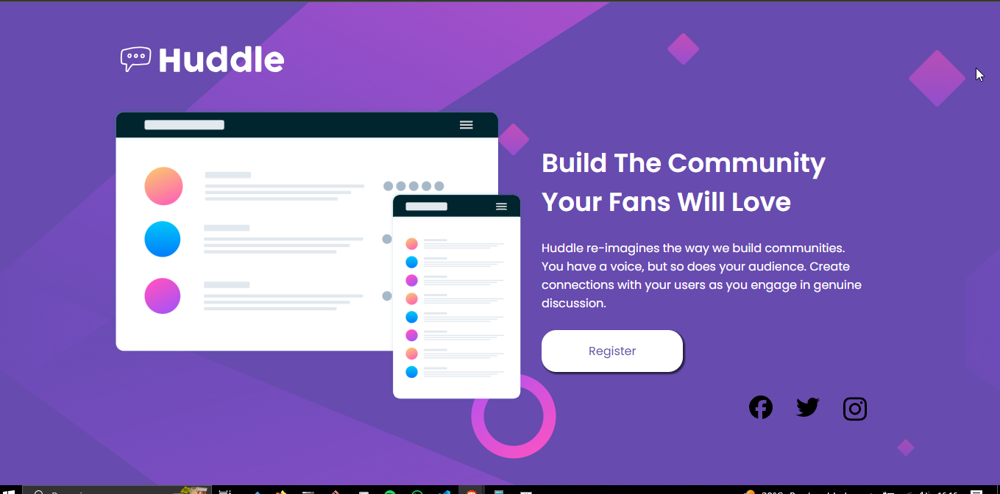
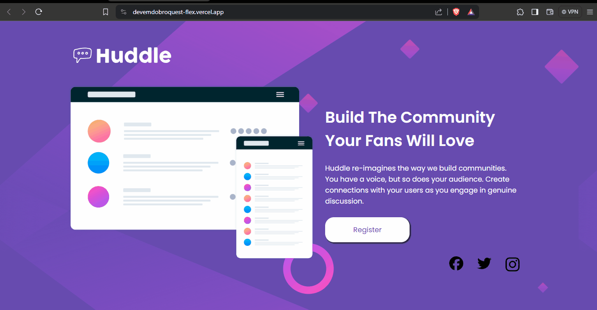

<h1 align="center">Projeto landing page </h1>

  Projeto da dev em dobro para praticar de acordo com o que aprendemos nas aulas de HTML e CSS do básico até o avançado. O foco são as propriedades flex e grid. Agora nesse projeto estou utilizando grid e flex.

 

  

## 🚀 Tecnologias

Esse projeto foi desenvolvido com as seguintes tecnologias:

- HTML e CSS(flex e grid)
- Git e Github

## 💻 Projeto

Projeto da dev em dobro. Praticar o que aprendi.

## Como ficou o projeto online

  

  
<a href="https://devemdobroquest-flex.vercel.app/" target="_blank">Clique para acessar o link</a>

## Conclusão

Como estou aprendendo grid, foi bem demorado em deixar ele do jeito que está no design.
A responsividade não está 100%.

Esse projeto serve para testar os conhecimentos básicos. Os professores e cordenadores da dev em dobro vão avaliar e mostrar os erros para não serem cometidos.